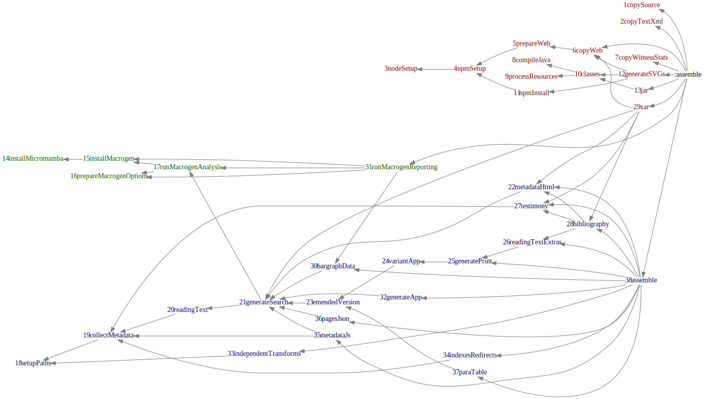

## Faust data generation

The Faust-Edition web application builds on data that is automatically pre-generated from the original XML files. This project integrates the various generation and upload processes (except for the images, actually).

## Basic Build 

The recommended way to build the edition is to use gradle:

```bash
git clone --recursive https://github.com/faustedition/faust-gen
cd faust-gen
./gradlew build
```

This will clone this repository and all of its subrepositories, download (almost¹) everything that is needed to build and runs the build. As a result, you can find:

* the complete site except for the facsimiles and the search app in `build/www`
* the search app ready to be deployed into eXist in `build/faust-*.xar`

and a lot of auxilliary and intermediate files in `build`.

For the build to run, you need to have _Java_ installed locally. 

For the `deployRSync` step, you need a local rsync and make sure we can build a ssh connection to the target server (e.g., by providing an SSH agent with an unlocked key).

## eXist-based search

There is a preliminary eXist app that implements the search functionality. Deploying the app to the eXist server automatically from the build is not really tested, there is a hack without proper configuration in the `deployToExist` target. The recommended way, however, is to build the xar (`./gradlew build` or `./gradlew xar`) and deploy it to eXist manually. For a fresh install, this can be done by putting the app into eXist’s `autodeploy` folder.

## Advanced usage

!! Parts of this section are slightly outdated …

## Components

### Diplomatic transcripts: SVG generation

The diplomatic transcripts are rendered page by page using JavaScript in a simulated browser. 

The code that does the actual rendering can be found in <svg_rendering/page>. This folder contains a simple web page, with font resources etc. pulled in from faust-web, plus the rendering code mainly developed by Moritz Wissenbach in <svg_rendering/page/js_gen>. 

To create both the diplomatic transcript and the overlay transcript for a single page, <render-multi-pages.js> is called using node.js. This uses [Puppeteer](https://pptr.dev/) to remote-control a headless Chromium browser in which each page will be rendered as SVG. The SVGs will then be extracted and stored so they can later be included in the edition’s UI. Finally, the whole site of a complete witness will be rendered to a downloadable PDF file.

The JS does not directly work with the XML transcripts. Instead, each page needs to be transformed to a JSON representation, which is done using code from https://github.com/faustedition/faust-app, which is pulled in as a Maven dependency. The Java program at <src/main/java/net/faustedition/gen/DiplomaticConversion.java> is used to run the actual pipeline, i.e. iterate through the manuscripts and their pages, convert stuff to JSON, and run <rendersvgs.js> on each of these JSON files. Intermediate results (i.e. JSON files) and, if enabled, debugging data (e.g., PDFs) are written to the target directory.

The process will run in parallel on multiple cores, and it may take quite long (30-90min).

### Textual transcripts, metadata, and overview data

Basically all other data that depends on the source data is generated using the https://github.com/faustedition/faust-gen-html project, which is cloned as a submodule to `src/main/xproc`. This includes:

* an emended XML version of all textual transcripts as TEI
* a reading version, and a line-wise apparatus out of this version
* an inline apparatus _(Einblendungsapparat)_ for all textual transcripts as HTML
* an HTML version of the metadata, and the project's bibliography
* the JSON basis for the genesis bar graph
* various other JSON data used by the web application

This process takes around 1/2h, it is bound to the xproc profile. You can run individual parts from within that project, I still recommend using gradle tasks since that will generate required dependencies.

### Experimental Macrogenetic Analysis

The macrogenesis part will produce various things:

* a zip file with the internal analysis data 
* `build/order.xml`, a file with an estimated sorting order 
* various report on details of the internal analysis, in `build/www/macrogenesis`, later part of the web site 
* rendered SVGs for a lot of graphs for the report

The analysis will take 10-15 minutes. Most of the reporting will be quick, but rendering a few large graphs may take a long time (hours) or even fail. A timeout can be specified, see the macrogenesis project’s documentation.

### Web application, and putting it all together

The web application, i.e. all non-generated code, is pulled in from http://github.com/faustedition/faust-web as submodule `src/main/web`. 

<build.gradle> contains code to actually run this all, and copy stuff around. Afterwards, the complete web site (except for the digitized manuscripts) can be found at `build/www`. If you run the `deployRsync` task, it is rsynced to the server.

Gradle will try to parallelize some parts of the workflow. The following (generated) diagram shows the dependencies of the various tasks for the `gradle build`. Red tasks come from the main project, green ones from macrogenesis, blue ones from the xproc stuff (faust-gen-html). The superscript numbers are the order in which the tasks will be queued, the gray arrows indicate a dependency.



## Semiautomatical stuff

There are two steps that involve pulling in data from the internal wiki:

* The table of testimonies, generated using <get_testimonies.py> and saved to `src/main/web/archive_testimonies.php`
* The input file for the bibliography, see faust-gen-html

## Not integrated yet

* filling the eXist instance, see the scripts in faust-gen-html
* preparing the facsimiles, see convert.sh 
